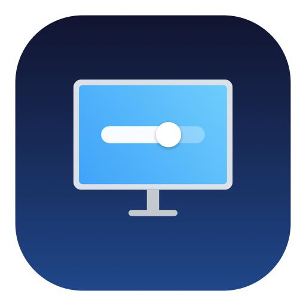

<p align="center">
  
</p>

<h1 align="center">OpenDisplay</h1>

<p align="center">
  Open-source macOS display manager. Free alternative to BetterDisplay.<br>
  <a href="https://sahilmishra0012.github.io/OpenDisplay/">Website</a> · <a href="https://github.com/sahilmishra0012/OpenDisplay/releases/latest">Download</a> · <a href="#install">Install</a>
</p>

<p align="center">
  <a href="https://github.com/sahilmishra0012/OpenDisplay/releases/latest"></a>
  
  
  <a href="https://github.com/sahilmishra0012/OpenDisplay/blob/main/LICENSE"></a>
  <a href="https://github.com/sahilmishra0012/OpenDisplay/stargazers"></a>
</p>

---

## Features

| | Feature | Details |
|---|---|---|
| 🖥 | **DDC/CI Control** | Brightness, contrast, volume, sharpness, input switching, power on/off |
| 🎛 | **Resolution** | All modes including hidden HiDPI, refresh rate switching, display arrangement |
| 🌙 | **Night Shift** | Scheduled color temperature, gamma & overlay dimming, dim to black |
| ☀️ | **HDR Brightness** | Unlock XDR/HDR up to 1600 nits on supported displays |
| 🪟 | **Window Tiling** | Edge snapping, corners, grid layouts (2×2, 3×2), auto-tile all windows |
| 📋 | **Profiles** | Save/load display settings, auto-apply when a monitor connects |
| ⌨️ | **CLI & Automation** | Full CLI, URL scheme (`opendisplay://`), global hotkeys, Shortcuts-ready |
| 🔆 | **Smart Sync** | Ambient light sensor sync, multi-display brightness sync |
| 🪶 | **Lightweight** | Native Swift, under 1MB, menu bar app, no Electron |

---

## Install

**Homebrew**
```bash
brew tap sahilmishra0012/opendisplay
brew install --cask opendisplay
```

**Direct Download** — [latest release](https://github.com/sahilmishra0012/OpenDisplay/releases/latest) (DMG or ZIP)

**Build from source**
```bash
git clone https://github.com/sahilmishra0012/OpenDisplay.git
cd OpenDisplay && swift run
```

---

## Usage

**CLI**
```bash
opendisplay --list                           # List displays
opendisplay --display 0 --brightness 70      # Set brightness
opendisplay --display 0 --input hdmi1        # Switch input
opendisplay --display 0 --resolution 2560x1440
opendisplay --help                           # All commands
```

**URL Scheme** — works with Raycast, Shortcuts, Alfred
```
opendisplay://brightness/80?display=0
opendisplay://input/hdmi1
opendisplay://tile/left
opendisplay://profile/MyProfile
```

**Menu Bar** — left-click opens the full UI, right-click for quick brightness presets and profiles.

---

## Known Limitations

| Issue | Workaround |
|---|---|
| HDMI on Apple Silicon doesn't support DDC | Connect via USB-C/Thunderbolt, or use gamma dimming fallback |
| Some monitors have partial DDC support | Depends on monitor firmware — not all features work on all monitors |
| Window tiling needs Accessibility permission | System Settings → Privacy & Security → Accessibility |

---

## Contributing

PRs welcome! Some ideas: virtual displays, keyboard shortcut config UI, LG webOS TV control, Picture-in-Picture, localization.

## License

[MIT](LICENSE)
